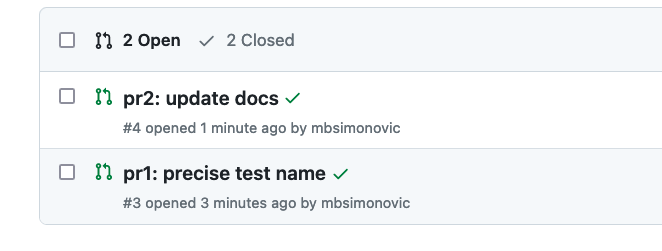

<h1 align="center">🛠️ Github merge queues demo</h1>
 

## Intro

This repo is used to discover how [Github merge queues](https://docs.github.com/en/repositories/configuring-branches-and-merges-in-your-repository/configuring-pull-request-merges/managing-a-merge-queue) work by using a simple node.js project and Github Actions for CI.
The app pulls current weather data from OpenWeatherMap for a location.

---
### Running

- `npm start` will run the main file (app.js) and display results for Berlin
- `node app --location Paris` will run app.js for a custom location, e.g. Paris
- `npm test` will run the Mocha tests, output results and generate reports

---

# Merge Queue - the missing guide

There is a **single** queue per repo (at the moment). 

There's is just a handful of configuration options to control queue's behaviour:

It wasn't obvious how Merge limits affect queue's behaviour - the *minimum* defines 
_when_ queue starts merging PRs: as soon as one condition is met - N PRs added or M minutes passed.

Once merge queue is enabled, PRs can be added with _"Merge when ready"_ button:

Confirm:

It gets enqueued:

And eventually merged if status checks pass:

As PRs get added to the queue, Github will create a temporary branch and start merging
PRs in the way they are added to the queue, running checks after each merge.

Here's the flow for two PRs that get successfully merged:

1. We start by opening two PRs
    
2. Then add one by one to the queue. Their status icon changes to reflect that:
    
    
3. After "minimum PRs" limit is met (number of PRs or timeout), the queue starts merging them:
    
4. If all goes well you'll end up with two merge commits on the main branch:
    

The actions page shows order of actions:

1. tmp branch `gh-readonlhy-queue/main/pr..` branch is created
2. PR #3 is merged into the tmp branch, status checks pass
3. PR #3 gets merged into `main` (as defined by Minimum PRs)
4. tmp branch `gh-readonlhy-queue/main..` branch is (most likely) again created
5. PR #4 is merged into the tmp branch, status checks pass
6. PR #4 gets merged into `main`

This behaviour is controller by _Minimum pull requests to merge_, if it had been 2, then both PRs would've been merged into tmp branch before mering each into `main`.

If status checks fail, **that PR will be left out* and the queue will proceed
merging the remaning PRs. Here's a demo with 3 PRs where status checks fail for 
the second one:

1. We start by opening 3 PRs
    
2. enqueue them in order:
    
3. then eventually get processed:
    
    
    
4. PR #6 fails status checks since #5 modified the test file and it doesn't get merged:
    
5. That's **not indicated in any way** on the PR page:
    
6. and can be found in the CI/CD (Github Actions in this case):
    
7. or with email notifications if enabled:
    

From the actions page it follows (assuming no clock skew):

1. tmp branch `gh-readonlhy-queue/main..` branch is created
2. PR #5 is merged into the tmp branch, status checks pass
4. PR #6 is merged into the tmp branch, status checks fail
5. PR #5 gets merged into `main`
6. tmp branch `gh-readonlhy-queue/main..` branch is (most likely) again created
7. PR #7 is merged into the tmp branch, status checks pass
8. PR #7 gets merged into `main`

Let's update "Minimum pull requests to merge" to 2 and open two PRs:

1. Enqueue the first PR
    
2. It gets merged into tmp and checked, but not merged into `main` (unless 5min go by)
    
3. Enqueue the second PR
    
4. The second gets merged into tmp branch and status checks pass
    
5. Finally both get merged into main
    

## Open questions
1. can 2+ branches have branch protection rules that include merge queue? How are then PRs merged if from both get added to the queue?

